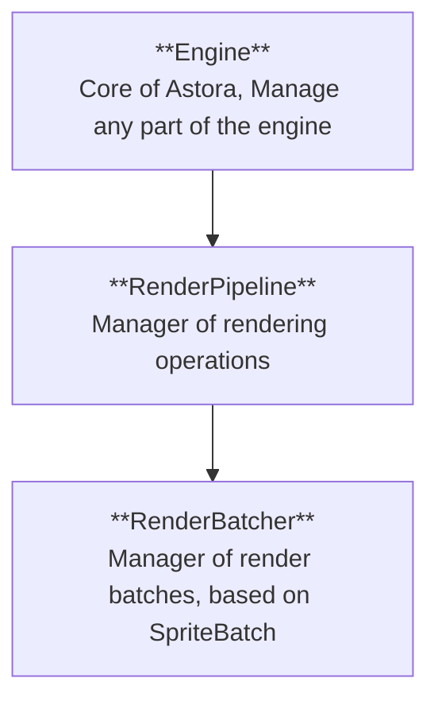

## Render Pipeline
The Render Pipeline is a core module of the Astora Engine, what is is the manager of all rendering operations. It is deal rendering automatically, and it is highly customizable through the use of Render Passes and other settings.

## Base Structure

